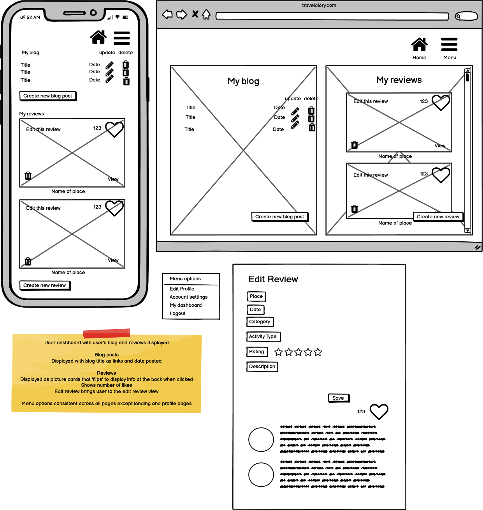

# Idea
Traveldiary aims to allow users to document their travel in the from of a diary/microblog, create public reviews for places of interests that will be made available ther users to vote and leave comments. Features will include:-

1. Creation/Deletion of user account
2. Log in and log out functionality
3. Upload images (profile and travel pictures)
4. Create, read, update and delete travel blog (private)
5. Create, read, update and delete public reviews (public)

[Trello board link](https://trello.com/b/CGY7wIhD)

# Wireframes
## Landing page
The landing page is where the user will be directed to as a new user or not logged into traveldiary. Should be an attractive in a travel related theme. Users who click on sign up will be directed to the sign up page.

## Profile page
Simple profile set up page for new users and existing users to update with simple profile information. Has a utility for users to upload profile photos.

## Dashboard
This is the user's dashboard with all of user's travel blog posts(private) and reviews(public) displayed in a visually pleasing layout. Options are available for users to edit reviews. As reviews are public on the platform and are voted, the number of votes are displayed on each review. Reviews are presented in a card format that shows a feature photo at the front and flips to display further information at the back.

The home button directs the user to the homepage and menu options are listed on this wireframe

## Blog
This is the template for users to enter in their blog posts. Photos can be uploaded to be displayed on the blog with at least 1 feature photo to be chosen as the main display. Other photos are displayed at the end of the blog post.

## Review
Template for users to create a new review for a particular place that they have visited. Only one photo can be uploaded for reviews.

## Homepage
Homepage lists all of the latest reviews from all other users of the platform in a card format that displays the feature photo at the front and flips to reveal further review info at the back. Users (other than the creator) are allowed to vote/like and comment on reviews. 

# Installation
In order to install this application:-
1. Ensure you have Python3.8, python3.8-venv and python3-pip installed on your system.
2. Clone the application onto your system from [GitHub](https://github.com/ashley190/traveldiary)
3. Navigate to the *traveldiary* folder, create and activate the python3.8 virtual environment.
4. Install application dependencies within the activated Python3.8 virtual environment by running `pip install -r requirements.txt`.